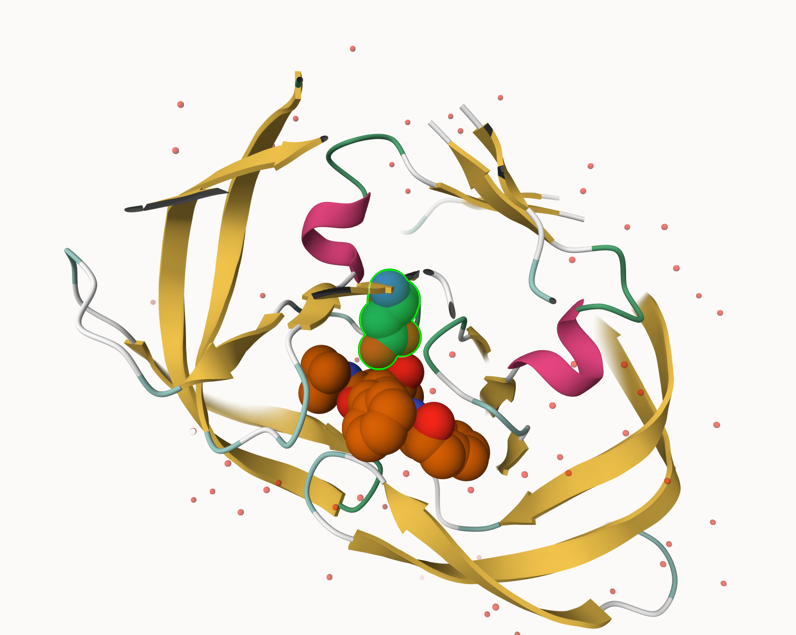
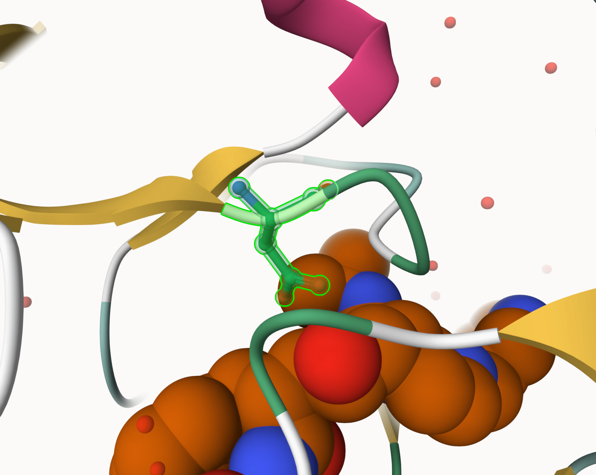
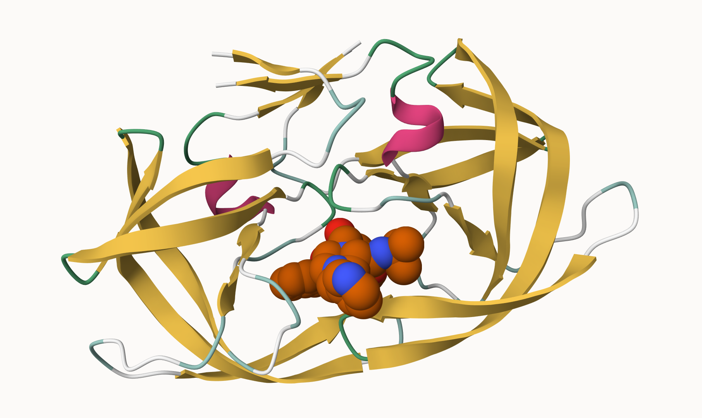

adding csv
```{r}
pdb <- read.csv("pdb_stats.csv", row.names = 1)
pdb
```

Q1: What percentage of structures in the PDB are solved by X-Ray and Electron Microscopy

```{r}
total_structures <- sum(pdb$Total)

xray_total <- sum(pdb$X.ray)
em_total <- sum(pdb$EM)

xray_pct <- (xray_total / total_structures) * 100
em_pct <- (em_total / total_structures) * 100

xray_pct
em_pct
```
> structures in PDB using X-ray: 80.95.077% and structures in PDB using EM: 12.83843%

Q2: What proportion of structures in the PDB are protein?

```{r}
total_pdb <- sum(pdb$Total)
protein_total <- pdb["Protein (only)", "Total"]

protein_prop <- protein_total / total_pdb
protein_prop
```
> 0.8596889 is the proportion of protein only which is 85.96%


Q3: Type HIV in the PDB website search box on the home page and determine how many HIV-1 protease structures are in the current PDB?

> Searching HIV in the website search box showed me that there are 1147 structures. 

Q4: Water molecules normally have 3 atoms. Why do we see just one atom per water molecule in this structure?

> because x-ray crystallography does not resolve hydrogen good so only the oxygen atom is actually visible. And the oxygen atom is only 1 out of the 3 atoms molecules for water.

Q5: There is a critical “conserved” water molecule in the binding site. Can you identify this water molecule? What residue number does this water molecule have

> HOH 306

Q6. Generate and save a figure clearly showing the two distinct chains of HIV-protease along with the ligand. You might also consider showing the catalytic residues ASP 25 in each chain and the critical water (we recommend “Ball & Stick” for these side-chains). Add this figure to your Quarto document.

```{r}



```

Q7: [Optional] As you have hopefully observed HIV protease is a homodimer (i.e. it is composed of two identical chains). With the aid of the graphic display can you identify secondary structure elements that are likely to only form in the dimer rather than the monomer?

> The four-stranded β-sheet at the dimer interface 

```{r}
library(bio3d)
pdb <- read.pdb("1hsg")
pdb

```

Q7: How many amino acid residues are there in this pdb object? 

> 198

Q8: Name one of the two non-protein residues? 

> HOH

Q9: How many protein chains are in this structure? 

> 2 chains


```{r}
library(bio3dview)
library(NGLVieweR)

view.pdb(pdb) |>
  setSpin()
```

```{r}
# Select the important ASP 25 residue
sele <- atom.select(pdb, resno=25)

# and highlight them in spacefill representation
view.pdb(pdb, cols=c("navy","teal"), 
         highlight = sele,
         highlight.style = "spacefill") |>
  setRock()

```
```{r}
adk <- read.pdb("6s36")
adk
```

```{r}
# Perform flexiblity prediction
m <- nma(adk)
```

```{r}
plot(m)

```

```{r}
mktrj(m, file="adk_m7.pdb")

```

```{r}
view.nma(m, pdb=adk)

```
Q10. Which of the packages above is found only on BioConductor and not CRAN? 

> msa

Q11. Which of the above packages is not found on BioConductor or CRAN?

> bio3dview

Q12. True or False? Functions from the pak package can be used to install packages from GitHub and BitBucket? 

> True

```{r}
library(bio3d)
aa <- get.seq("1ake_A")
```

Q13. How many amino acids are in this sequence, i.e. how long is this sequence? 

> 214 amino acids

```{r}
# Blast or hmmer search 
#b <- blast.pdb(aa)
hits <- NULL
hits$pdb.id <- c('1AKE_A','6S36_A','6RZE_A','3HPR_A','1E4V_A','5EJE_A','1E4Y_A','3X2S_A','6HAP_A','6HAM_A','4K46_A','3GMT_A','4PZL_A')

# Download releated PDB files
files <- get.pdb(hits$pdb.id, path="pdbs", split=TRUE, gzip=TRUE)
# Align releated PDBs
pdbs <- pdbaln(files, fit = TRUE, exefile="msa")

library(bio3dview)

view.pdbs(pdbs)
# Vector containing PDB database codes
ids <- basename.pdb(pdbs$id)

anno <- pdb.annotate(ids)
unique(anno$source)
anno

```

```{r}
# Perform PCA
pc.xray <- pca(pdbs)
plot(pc.xray)

```

```{r}
# Calculate RMSD
rd <- rmsd(pdbs)

# Structure-based clustering
hc.rd <- hclust(dist(rd))
grps.rd <- cutree(hc.rd, k=3)

plot(pc.xray, 1:2, col="grey50", bg=grps.rd, pch=21, cex=1)


```

```{r}
# Visualize first principal component
pc1 <- mktrj(pc.xray, pc=1, file="pc_1.pdb")

```

```{r}
#Plotting results with ggplot2
library(ggplot2)
library(ggrepel)

df <- data.frame(PC1=pc.xray$z[,1], 
                 PC2=pc.xray$z[,2], 
                 col=as.factor(grps.rd),
                 ids=ids)

p <- ggplot(df) + 
  aes(PC1, PC2, col=col, label=ids) +
  geom_point(size=2) +
  geom_text_repel(max.overlaps = 20) +
  theme(legend.position = "none")
p

```

```{r}
# NMA of all structures
modes <- nma(pdbs)
plot(modes, pdbs, col=grps.rd)

```

Q14. What do you note about this plot? Are the black and colored lines similar or different? Where do you think they differ most and why?

> the black lines show lower fluctuation compared to the colored lines. the colored lines fluctuate around 30-50 and especially near 120-160 residues. These regions correspond to LID and AMPbinding domains, which are mobile domains that open and close. structres that do not have a nucleotide bound are more flexible in these regions.


